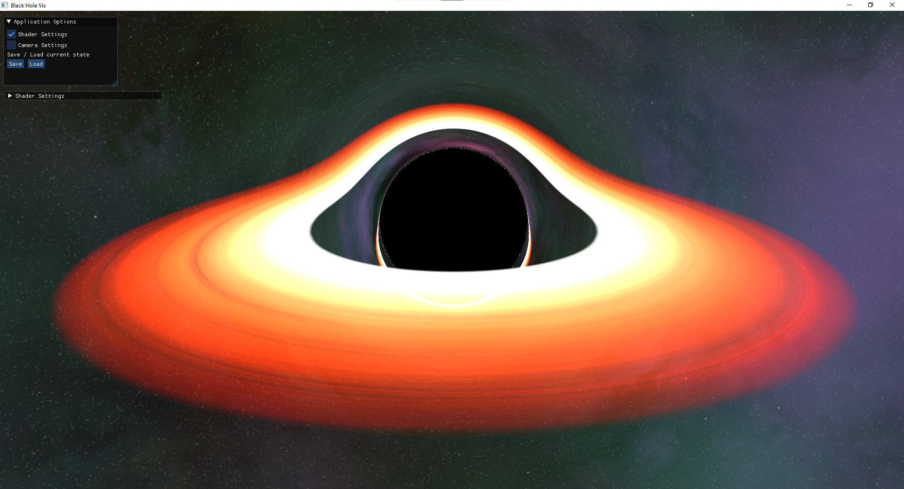

# BlackHoleVis
Computer Science Master's Project at the FSU Jena 

## Setup

### Dependencies
Hopefully, all dependencies should be loaded automatically by the CMakeLists.txt in thirdparty/. If successfull, they will be in [build-folder]/deps_.
- glm
- glad
- glfw
- imgui
- stb_image (included in thirdparty/)

### Windows
- open directory in CMake GUI
- select VS 2019
- Configure & Generate
- Open Project to open solution in VS

### Linux (TODO)

## Controls
- WASD: move camera
- SHIFT: move faster
- Mouse move & right mouse click: rotate camera

## Sources
### Images and Textures
- Alternative Skybox generated with [space-3d](https://wwwtyro.github.io/space-3d/#animationSpeed=1&fov=80&nebulae=true&pointStars=true&resolution=1024&seed=3wq0xhr2fwu8&stars=true&sun=false) by Rye Terrell
- Skybox panorama by [ESO](https://www.eso.org/public/germany/images/eso0932a/)
### Black Hole Visualization
- [LearnOpenGL](https://learnopengl.com/)
- [Randonels Starless](https://github.com/rantonels/starless)
- [Coding Train - Visualizing a Black Hole](https://www.youtube.com/watch?v=Iaz9TqYWUmA)
