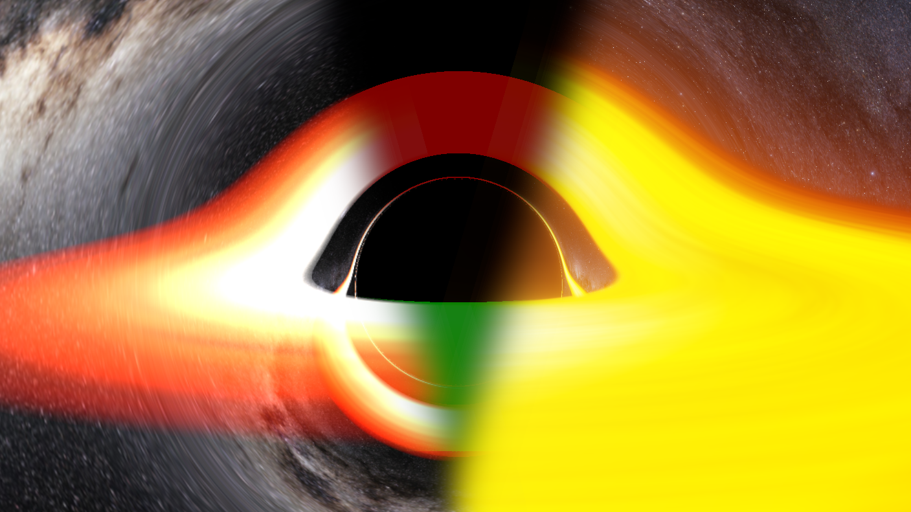

# BlackHoleVis
A project on black hole visualization 



## Setup

### Milky Way Panorama
init `resources/textures/ebruneton/gaia_sky_map` containing cubemap data from [E.Bruneton](https://github.com/ebruneton/gaia_sky_map):
```
git submodule update
git submodule init
```

### Dependencies
Dependencies are installed using [vcpkg](https://github.com/Microsoft/vcpkg).
- glm
- glad
- glfw
- imgui
- implot (0.12)
- stb_image
- boost-json (1.77.0)
- tinyobjloader
- cereal

### Windows
- [setup vcpkg](https://vcpkg.io/en/getting-started.html) (```vcpkg integrate install``` not required)
- open directory in CMake GUI
- select VS 2019
- add Entry:
	- name: ```CMAKE_TOOLCHAIN_FILE```
	- type: ```PATH```
	- value: ```[path to vcpkg]/scripts/buildsystems/vcpkg.cmake```
- Configure & Generate, vcpkg will install all dependencies listed in `vcpkg.json`
- Open Project to open solution in VS

### Linux (TODO)

## Contents
- [App 1](app/BlackHoleVis_1/README.md)
- [App 2](app/BlackHoleVis_2/README.md)
- [App 3](app/BlackHoleVis_3/README.md)
- [Kerr Vis](app/KerrVis/README.md)

## References on Black Hole Visualization
- [LearnOpenGL](https://learnopengl.com/)
- [Randonels Starless](https://github.com/rantonels/starless)
- [Coding Train - Visualizing a Black Hole](https://www.youtube.com/watch?v=Iaz9TqYWUmA)
- [Real-time High-Quality Rendering of Non-Rotating Black Holes](https://github.com/ebruneton/black_hole_shader)
