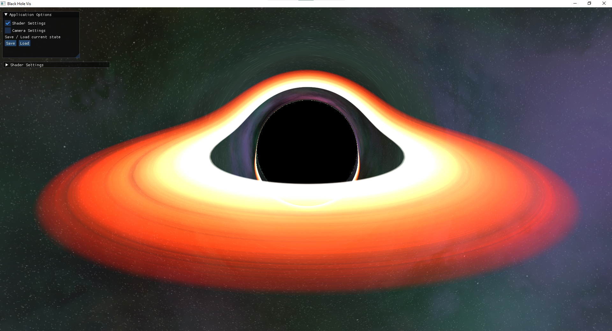

# BlackHoleVis 1

A simple visualization of a Schwarzschild black hole based on

- [Randonels Starless](https://github.com/rantonels/starless)
- [J.A. Marck, Short-cut method of solution of geodesic equations for Schwarzchild black hole](https://arxiv.org/abs/gr-qc/9505010)

## Controls
- WASD: move camera
- SHIFT: move faster
- Mouse move & right mouse click: rotate camera

## Sources
### Images and Textures
- Alternative Skybox generated with [space-3d](https://wwwtyro.github.io/space-3d/#animationSpeed=1&fov=80&nebulae=true&pointStars=true&resolution=1024&seed=3wq0xhr2fwu8&stars=true&sun=false) by Rye Terrell
- Skybox panorama by [ESO](https://www.eso.org/public/germany/images/eso0932a/)